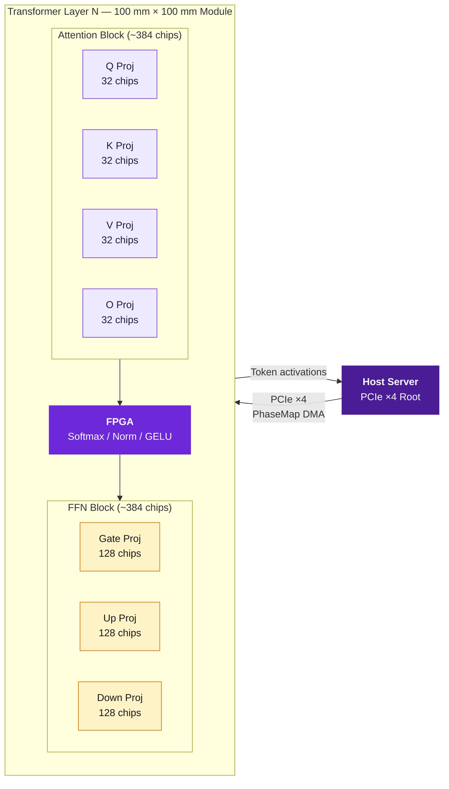

# PhotoMedGemma — Functionality & Pin Configuration

**Component Breakdown, Signal Specifications, and PhaseMap Architecture**

---

## 1. System Functionality Overview

PhotoMedGemma operates as a **hybrid electro-optic inference engine**. Trained weight matrices from the MedGemma-4B medical foundation model are compiled into photonic phase angles and stored permanently in on-chip DAC registers. At inference time, input token activations are converted to optical signals, propagated through the programmed MZI mesh, detected, digitised, and passed through an FPGA for non-linear operations before the next layer.

This document details the component-level functionality, all I/O pin groups with signal specifications, the PhaseMap addressing architecture, MZI register mapping, and a multi-chip deployment diagram showing how a single transformer layer is assembled from many photonic chips.

> **Repository:** [github.com/GabuGravin41/photonmedgemma](https://github.com/GabuGravin41/photonmedgemma)

---

## 2. Component Functionality Breakdown

### 2.1 Optical Input Stage

The optical input stage couples laser light — representing token activations — into the photonic chip. WDM is used to multiplex eight independent data lanes onto a single fibre, boosting effective throughput without increasing physical fibre count.

- **Laser Array** — Continuous-wave laser bank at 1,310 nm centre wavelength. Eight independently modulated WDM channels at ±400 GHz channel spacing. Laser drivers controlled by the 5 V analogue rail.
- **WDM Multiplexer** — Arrayed waveguide grating (AWG) combines 8 λ channels onto one fibre bus for input to the 64-channel FC/APC array.
- **Grating Coupler Array** — 64-channel grating coupler bank on north chip edge; couples external fibre to on-chip single-mode waveguides. Designed for 1,310 nm; target coupling efficiency >80%; 127 µm fibre pitch.
- **Input Modulation** — Amplitude of each input channel encodes the activation value for one feature dimension. At 64 channels × 8 WDM, the system accepts 512 activation values per optical clock cycle.

### 2.2 Photonic Compute Core — MZI Mesh

The photonic core is a 64×64 Clements-architecture MZI mesh that implements a unitary matrix transformation in the optical domain. The mesh is programmed by setting phase angles in the thermal phase shifters, which correspond to trained weight values compiled by the PhotoMedGemma pipeline.

- **MZI Cell (`mzi.py`)** — Each MZI is a 2×2 beam-splitter with adjustable internal angle θ (power splitting ratio) and external phase φ (relative phase). Transfer matrix: **T = [[cos θ, i·sin θ], [i·sin θ, cos θ]] × diag(e^{iφ}, 1)**.
- **Phase Shifter (`phase_shifter.py`)** — TiN (titanium nitride) thermal heater above each waveguide. Nominal resistance ~500 Ω. Applied voltage raises local temperature, changing waveguide refractive index via the thermo-optic effect. Power for π-shift: 10–20 mW. Full tuning range: 0 to 2π.
- **Clements Mesh Pattern (`mesh.py`)** — Columns of alternating even/odd MZI pairs achieve universal N×N unitary coverage. A 64×64 mesh requires ⌊64²/2⌋ = 2,048 MZIs per unitary; two unitaries (U and Vᵀ) per layer = 4,096 MZIs/chip.
- **Waveguides & Splitters** — Single-mode silicon waveguides (500 nm × 220 nm cross-section, 1,310 nm). Y-junction 1×2 splitters and 2×2 directional couplers form the mesh fabric. Target propagation loss <1 dB/cm.

### 2.3 Singular Value (Σ) Diagonal Encoding

After SVD decomposition (**W = U Σ Vᵀ**), the diagonal singular value matrix Σ is encoded as amplitude attenuation values on the waveguide paths between the U-mesh and the Vᵀ-mesh. This is implemented via variable optical attenuators (VOAs) or additional MZI cells set to partial transmission.

- Each singular value σᵢ maps to a VOA transmission coefficient **τᵢ = σᵢ / σ_max**
- Rank truncation means only *r* < 64 singular values are non-zero; remaining waveguides are blocked

### 2.4 Photodetection Stage

After the optical matrix-vector product, the output optical field is captured by an array of integrated photodetectors. Detected photocurrent is proportional to the squared amplitude (intensity) of each output mode, recovering the real-valued result of the matrix product.

- **128 photodetectors** — cover both U and Vᵀ mesh outputs (64 per mesh)
- **Responsivity** — ~1.0 A/W at 1,310 nm (InGaAs or Ge-on-Si integrated PD)
- **12-bit ADC** — 128 channels, 1 MHz sampling rate per channel, SNR >60 dB
- **Noise floor** — shot noise limited at operating optical power; thermal noise from ADC input

### 2.5 Electronic Control & Non-Linear Processing (FPGA/CPU)

All operations that cannot be performed optically are delegated to the on-board FPGA/CPU. This includes the non-linear activation functions and normalisation layers of the transformer architecture.

- **Softmax** — Applied to attention score matrix in FPGA using fixed-point arithmetic
- **LayerNorm** — Mean and variance computed over 64-sample ADC output vector; normalised and scaled
- **GELU / SiLU Activation** — Piecewise polynomial approximation in FPGA lookup table for FFN non-linearity
- **KV-Cache Management** — Query/Key/Value cache stored in FPGA BRAM / host DDR; managed across inference tokens
- **Residual Add** — Digital accumulator adds skip-connection values to layer output before next optical input

### 2.6 DAC Phase Control

The 16-bit DAC array translates digital phase register values (from the PhaseMap) into analogue voltages that drive the TiN heaters. This is the programming interface between the compiled model and the physical chip.

- **4,096 DAC channels per chip** — one per phase shifter
- **16-bit resolution** → 65,536 voltage levels over 0–3.3 V range; effective phase resolution better than 12-bit after heater calibration
- **SPI protocol** — Serial peripheral interface; chip-select daisy-chain for multi-chip addressing; max SPI clock 50 MHz
- **Refresh rate** — Full chip reprogramme: ~82 ms at 50 MHz SPI (4,096 × 16-bit registers); static inference: registers held, no refresh needed

---

## 3. Pin / Signal Configuration

The following tables enumerate every signal group on the PhotoMedGemma chip and board interfaces, matching the specifications in `docs/chip_architecture.md`.

### 3.1 Optical Input Signals

| Signal Group | Count | Width / Spec | Connector / Protocol | Function |
|---|---|---|---|---|
| Laser input fibres | 64 | FC/APC, SM 1310 nm | 64-ch fibre array (north edge) | Carry WDM-modulated input activations into grating couplers |
| WDM channels per fibre | 8 | 1310 nm ± 400 GHz spacing | AWG internal | 8 independent activation values per physical fibre |
| Total optical input modes | 512 | 64 fibres × 8 λ | — | Total simultaneous input feature dimensions |
| Grating coupler pitch | 64 couplers | 127 µm spacing | North chip edge | FC/APC array physical connector |
| Optical power per channel | ~1 mW | CW, per λ | Laser driver board | Required for SNR >20 dB at photodetector |

### 3.2 Optical Output Signals

| Signal Group | Count | Width / Spec | Connector / Protocol | Function |
|---|---|---|---|---|
| Output fibres | 64 | FC/APC, SM 1310 nm | 64-ch fibre array (south edge) | Carry matrix-product optical outputs to photodetectors |
| Photodetector channels | 128 | 12-bit ADC, 1 MHz | On-chip PD array | 128 = 64 (U-mesh) + 64 (Vᵀ-mesh) outputs |
| ADC sampling rate | 1 MHz | per channel | ADC ASIC / FPGA | Sets maximum inference token rate |
| ADC resolution | 12-bit | 4,096 levels | ADC buffer board | Effective ENOB ~10.5 bits after noise floor |

### 3.3 Phase Control Signals (Heaters)

| Signal Group | Count | Width / Spec | Connector / Protocol | Function |
|---|---|---|---|---|
| Heater channels | 4,096 | per chip | Bond pads east/west edge | One TiN heater per MZI phase element |
| DAC channels | 4,096 | 16-bit per channel | SPI DAC array | Drives heater voltage 0–3.3 V |
| SPI clock | 1 | 50 MHz max | SPI header on control board | Daisy-chained for multi-chip |
| SPI data | 1 (MOSI) | 16-bit frames | SPI header | `chip_id | register_addr | dac_value` |
| SPI chip-select | N_chips | per chip | PCB routed | Selects active chip in daisy chain |
| Heater voltage range | 0–3.3 V | analogue | 5 V rail → LDO 3.3 V | Sets phase 0 to 2π across heater |
| Heater π-shift power | 10–20 mW | per MZI (static) | 5 V analogue rail | Only dissipated during phase set; static for fixed weights |
| Calibration register | 1 per chip | 8-bit offset | I²C from FPGA | Corrects systematic heater offset per chip at startup |

### 3.4 Power Supply Rails

| Signal Group | Count | Width / Spec | Connector / Protocol | Function |
|---|---|---|---|---|
| 3.3 V digital | 1 | ≤5 A | PCIe power connector | FPGA core, SPI logic, microcontroller, DAC digital side |
| 5 V analogue | 1 | ≤8 A | PCIe power connector | Laser drivers, DAC analogue output stage, ADC, heater LDO input |
| 12 V TEC | 1 | ≤10 A | PCIe power connector / external | Thermo-electric cooler; also powers TEC controller and on-chip sensors |
| 1.8 V core (internal) | 1 | LDO on board | Derived from 3.3 V | FPGA I/O banks and ADC reference |

### 3.5 Host Interface

| Signal Group | Count | Width / Spec | Connector / Protocol | Function |
|---|---|---|---|---|
| PCIe ×4 lane | 4 | Gen 3 / 8 GT/s per lane | PCIe edge connector | Host DMA for PhaseMap upload, activation data, calibration |
| PCIe total bandwidth | 1 | ~16 Gbps bidirectional | PCIe edge connector | Sufficient for full chip reprogramme in <10 ms |
| Standalone UART | 1 | 115,200 baud | Micro-USB / header | Debug console, firmware update, manual register access |
| I²C bus | 1 | 400 kHz | Header on control board | Temperature sensor readout, TEC set-point, calibration EEPROM |
| GPIO debug | 8 | 3.3 V logic | Test points on PCB | Trigger, sync, status LEDs, overflow flags |

### 3.6 Thermal Control I/O

| Signal Group | Count | Width / Spec | Connector / Protocol | Function |
|---|---|---|---|---|
| On-chip temperature sensors | 4 | ±0.1 °C accuracy | I²C from board | Distributed across die; feed PID controller |
| TEC hot-side current | 1 | 0–8 A bidirectional | TEC driver H-bridge | Positive = cooling; negative = heating |
| TEC voltage | 1 | 0–12 V | 12 V rail | Proportional to ΔT set-point |
| PID set-point | 1 | register via I²C | FPGA I²C master | Target die temperature for phase stability ±0.01 °C |
| Fan control PWM | 1 | 25 kHz PWM | Header | Controls heatsink fan speed proportional to TEC hot-side temp |

---

## 4. Chip Pin Group Summary (YAML)

The following YAML block provides a machine-readable summary of all pin groups, suitable for integration with PCB design tools or the chip platform configuration file (`chip_platform_config.yaml`).

```yaml
chip_pin_groups:

  optical_input:
    grating_couplers:   { count: 64,  connector: FC/APC, edge: north }
    wdm_channels:       { count: 8,   wavelength: 1310nm, spacing_GHz: 400 }
    total_input_modes:  512

  optical_output:
    grating_couplers:   { count: 64,  connector: FC/APC, edge: south }
    photodetectors:     { count: 128, adc_bits: 12, rate_MHz: 1 }

  phase_control:
    heater_channels:    { count: 4096, type: TiN_thermal, v_range: [0, 3.3] }
    dac_channels:       { count: 4096, bits: 16, protocol: SPI }
    spi_clock_MHz:      50
    spi_frame_bits:     44      # chip_id(16) | reg_addr(12) | value(16)
    pi_shift_power_mW:  [10, 20]

  power_rails:
    digital_3v3:        { voltage: 3.3,  max_current_A: 5,  rail: PCIe }
    analogue_5v:        { voltage: 5.0,  max_current_A: 8,  rail: PCIe }
    tec_12v:            { voltage: 12.0, max_current_A: 10, rail: PCIe_or_external }
    core_1v8_internal:  { voltage: 1.8,  source: LDO_from_3v3 }

  host_interface:
    pcie:               { lanes: 4, gen: 3, bandwidth_Gbps: 16 }
    uart_debug:         { baud: 115200, connector: micro_USB }
    i2c:                { speed_kHz: 400, devices: [temp_sensors, tec, eeprom] }
    gpio_debug:         { count: 8, voltage: 3.3 }

  thermal_control:
    temp_sensors:       { count: 4, accuracy_C: 0.1, interface: I2C }
    tec_current_A:      { range: [-8, 8], driver: H_bridge }
    pid_precision_C:    0.01
    fan_pwm_kHz:        25

  die_physical:
    size_mm:            [10, 10]
    mzi_count_max:      4096
    clements_mesh:      [64, 64]
    bond_pad_edges:     [east, west]
    module_size_mm:     [100, 100]    # multi-chip assembly
```

---

## 5. PhaseMap — MZI Addressing Architecture

> **Key Idea — PhaseMap**
> The PhaseMap is the central data structure generated by `phase_encoder.py`. It provides a complete mapping from logical model coordinates to physical chip hardware registers, allowing the same compiler output to target different physical chip assemblies without modification.

---

### PhaseMap Data Flow — Logical to Physical

```mermaid
flowchart LR
    A["`MZI angles
    θᵢ, φᵢ (float32)`"]

    B["`12-bit Quantisation
    DAC_val = round(θ / 2π × 4095)`"]

    C["`**PhaseMap lookup**
    (layer_id, matrix_id, row, col)`"]

    D["`Chip address
    (chip_id, register_addr)`"]

    E["`SPI packet
    chip_id:16 | reg:12 | val:16`"]

    F["`DAC output
    0–3.3 V analogue`"]

    G["`TiN Heater
    ΔΦ = α·ΔT → phase shift`"]

    A --> B --> C --> D --> E --> F --> G

    style A fill:#d1fae5,stroke:#059669,color:#1c1917
    style C fill:#fef3c7,stroke:#d97706,color:#1c1917
    style D fill:#fef3c7,stroke:#d97706,color:#1c1917
    style G fill:#4a1d96,color:#fff,stroke:#4a1d96
    style B fill:#ede9fe,stroke:#7c3aed,color:#1e1b4b
    style E fill:#ede9fe,stroke:#7c3aed,color:#1e1b4b
    style F fill:#fce7f3,stroke:#9d174d,color:#1e1b4b
```



---

### 5.1 Logical Address Space

Each phase angle in the compiled model is assigned a four-tuple logical address:

```
PhaseMap key:  (layer_id, matrix_id, row, col)

  layer_id   : 0 .. 25         — transformer layer index
  matrix_id  : {Q, K, V, O, gate, up, down, U, Vt}
  row        : 0 .. 63         — MZI mesh row within chip
  col        : 0 .. 63         — MZI mesh column within chip
```

### 5.2 Physical Address Space

Each logical address resolves to a physical `(chip_id, register_address)` pair:

```
PhaseMap value:  (chip_id, register_address)

  chip_id       : 0 .. N_chips-1   — unique per chip in module
  register_addr : 0 .. 4095        — DAC channel index on that chip

SPI packet (44 bits total):
  [15:0]   chip_id       16 bits — select target chip in daisy chain
  [27:16]  register_addr 12 bits — select DAC channel (0–4095)
  [43:28]  dac_value     16 bits — phase angle encoded value
```

### 5.3 Quantisation Detail

Phase angles θ and φ ∈ [0, 2π] are quantized to 12-bit DAC codes for on-chip storage, then loaded into 16-bit DAC registers (4 LSBs are sub-LSB dither for calibration):

```
dac_code_12bit = round( angle_radians / (2π) × 4095 )
dac_code_16bit = dac_code_12bit << 4 | calibration_offset[chip_id][reg]

Phase resolution : 2π / 4095 ≈ 0.00153 rad     (12-bit)
Voltage step     : 3.3 V / 65535 ≈ 50 µV        (16-bit DAC)
Phase error      : σ_φ ≈ 0.001 rad  →  model accuracy loss <0.1%  (error_analysis.py)
```

### 5.4 Heater Alignment & Calibration Table

At startup, a per-chip calibration sweep measures the actual phase vs voltage curve for each heater, correcting for process variation (heater resistance spread ~5%, thermo-optic coefficient variation ~2%). Results are stored in calibration EEPROM and loaded into the PhaseMap offset table.

| Parameter | Nominal | Process Variation | Calibration Method | Post-Cal Accuracy |
|---|---|---|---|---|
| Heater resistance | 500 Ω | ±5% | 4-wire Kelvin measurement at startup | ±0.5 Ω |
| Thermo-optic coeff. | 1.86 × 10⁻⁴ /K | ±2% | MZI null-balance sweep | ±0.1% |
| π-shift voltage | ~2.3 V | ±8% | Sweep V until Δφ = π (null output) | ±0.5% |
| Phase drift (thermal) | <0.01 rad/°C | — | TEC holds die to ±0.01 °C | <10⁻⁴ rad drift |
| Cross-talk (adjacent) | <−30 dB | — | Mesh guard ring | Negligible |

---

## 6. Multi-Chip Deployment Diagram — Attention Layer

A single MedGemma-4B transformer attention block requires matrix projections of dimension 2,048 × 2,048. Because each chip implements a 64×64 Clements mesh, a 2,048-dimensional projection is tiled across ⌈2048/64⌉² = 32² ≈ 32 chips (for each of U and Vᵀ). Including all Q/K/V/O projections and FFN, a full transformer layer uses approximately 760+ chips, assembled into a 100 mm × 100 mm multi-chip module.

---

### Multi-Chip Deployment — Single Transformer Layer



### 6.1 Chip-to-Chip Interconnect

- **Inter-chip optical links** — fibre ribbon connectors between chip output (south grating couplers) and next chip input (north grating couplers)
- **Intermediate detection** — only at layer boundaries and after non-linear stages; intra-block data stays optical
- **PCIe control fanout** — host PCIe ×4 root → PCIe switch → one endpoint per 100 mm × 100 mm module
- **SPI daisy-chain** — 4,096 chips addressable via 16-bit chip_id field; SPI clock distributed via LVDS fanout buffer

---

## 7. How This Repository Implements Each Feature

| Hardware Feature | Source File(s) | Implementation Notes |
|---|---|---|
| MZI 2×2 transfer matrix | `src/photonic/mzi.py` | `transfer_matrix(theta, phi)` returns 2×2 complex numpy array; balanced + unbalanced modes |
| Clements mesh simulation | `src/photonic/mesh.py` | `propagate(field_vector)` chains MZI transfer matrices stage by stage; returns output complex amplitudes |
| TiN phase shifter model | `src/photonic/phase_shifter.py` | `phase_from_voltage(V, R, alpha_TO)` thermal model; `pi_shift_power` property; tuning range 0–2π |
| Grating coupler model | `src/photonic/grating_coupler.py` | `coupling_efficiency(lambda_nm, angle_deg)`; 64-channel array geometry; insertion loss |
| Photodetector + ADC | `src/photonic/photodetector.py` | `detect(field)` → photocurrent; `add_noise(sigma)`; `quantise(bits=12)`; 128-channel array class |
| Waveguide propagation | `src/photonic/waveguide.py` | `propagate(field, length_um, loss_dBcm)`; `bend_loss(radius_um)`; single-mode at 1310 nm |
| SVD decomposition | `src/compiler/layer_decomposer.py` | `torch.linalg.svd(W)`; `truncate_rank(energy=0.99)`; `pad_to_power2()`; returns U, sigma, Vt |
| Clements decomposition | `src/compiler/clements.py` | `clements_decompose(U_matrix)` → list of `(col, row, theta, phi)` MZI params; tested in `test_clements.py` |
| PhaseMap construction | `src/compiler/phase_encoder.py` | `build_phasemap(layer_id, matrix_id, mzi_list)` → dict; `quantise_angle(theta, bits=12)`; calibration offset |
| SPI register encoding | `src/compiler/phase_encoder.py` | `encode_spi_packet(chip_id, reg_addr, dac_val)` → 44-bit int; `chip_platform_config.yaml`: spi_clock, frame_fmt |
| Chip address routing | `src/compiler/mzi_mapper.py` | `map_to_chip(layer_id, matrix_id, row, col)` → `(chip_id, reg)`; uses `chip_platform_config.yaml` tile layout |
| Photonic netlist | `src/compiler/netlist_generator.py` | `generate_pntl(phasemap, mesh_config)` → `.pntl` file; component IDs; waveguide routing table; coupler specs |
| GDS physical layout | `src/compiler/generate_layout.py` | gdspy / klayout API; places MZI cells; routes waveguides; places grating couplers; generates bond pad ring |
| Attention forward pass | `src/photonic/attention.py` | `optical_qkv(input)`; `fpga_softmax(scores)`; `optical_output_proj(v)`; `residual_add()` |
| FFN forward pass | `src/photonic/feedforward.py` | `optical_gate_up(input)`; `fpga_silu(x)`; `optical_down(x)`; `residual_add()` |
| Layer norm (FPGA) | `src/photonic/layer_norm.py` | `fpga_layernorm(x, gamma, beta)`; fixed-point mean/var; returns normalised tensor |
| Full model orchestration | `src/photonic/medgemma_photonic.py` | 26-layer loop; routes tokens through attention + FFN; manages KV-cache; calls chip DAC upload |
| Error / power analysis | `src/compiler/error_analysis.py`, `power_model.py` | Monte-Carlo phase noise; per-layer accuracy metric; laser P_in + N_heater × P_heater + ADC/DAC quiescent |
| Model config | `medgemma_4b_config.yaml` | `hidden_dim: 2048`, `n_layers: 26`, `n_heads: 8`, `ffn_dim: 8192`, `rank_threshold: 0.99` |
| Process constants | `chip_platform_config.yaml` | `wg_loss_dB_cm: 1.0`, `coupler_ER_dB: 30`, `heater_alpha: 1.86e-4`, `fab_R_tolerance: 0.05` |
| Architecture specification | `docs/chip_architecture.md` | Authoritative source for all pin counts, rail voltages, die dimensions, MZI count, thermal spec |
| Compilation pipeline spec | `docs/compilation_pipeline.md` | Stage-by-stage pipeline description; data format specs; YAML config references |

---

## 8. Application Benefits for Medical AI

> **Key Idea — Energy Efficiency**
> ~8 W per layer vs ~300 W GPU baseline — a 97% power reduction — enables battery-operated or clinic-grade deployment in environments where GPU-scale power is impractical.

> **Optical Compute Speed**
> MZI matrix multiplication occurs at the speed of light. No digital multiply-accumulate latency applies to the linear portions of inference.

> **Weight Privacy**
> Weights are physically encoded into phase angles; the trained model cannot be extracted from the chip in digital form.

> **Deterministic Inference**
> Fully static weight programming eliminates stochastic GPU scheduling jitter — a critical property for regulatory-grade medical devices.

> **Scalable Architecture**
> PhaseMap + multi-chip module design scales to any transformer model size without redesigning the chip or compiler.

---

*Repository: [github.com/GabuGravin41/photonmedgemma](https://github.com/GabuGravin41/photonmedgemma)*