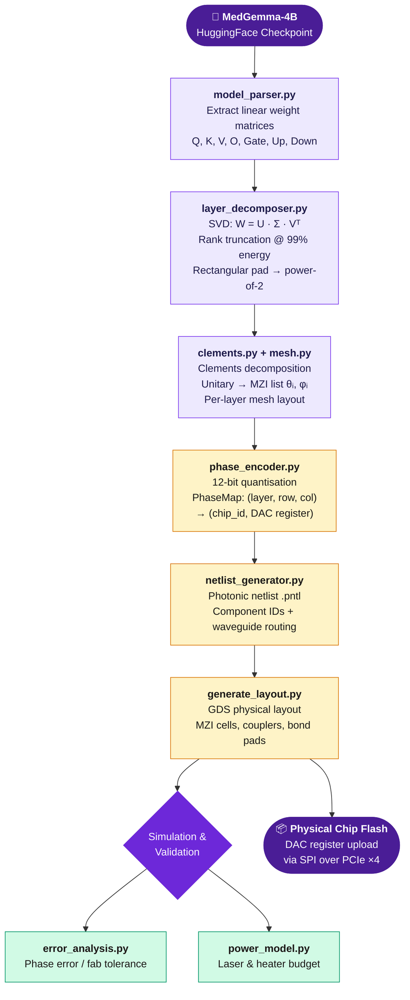
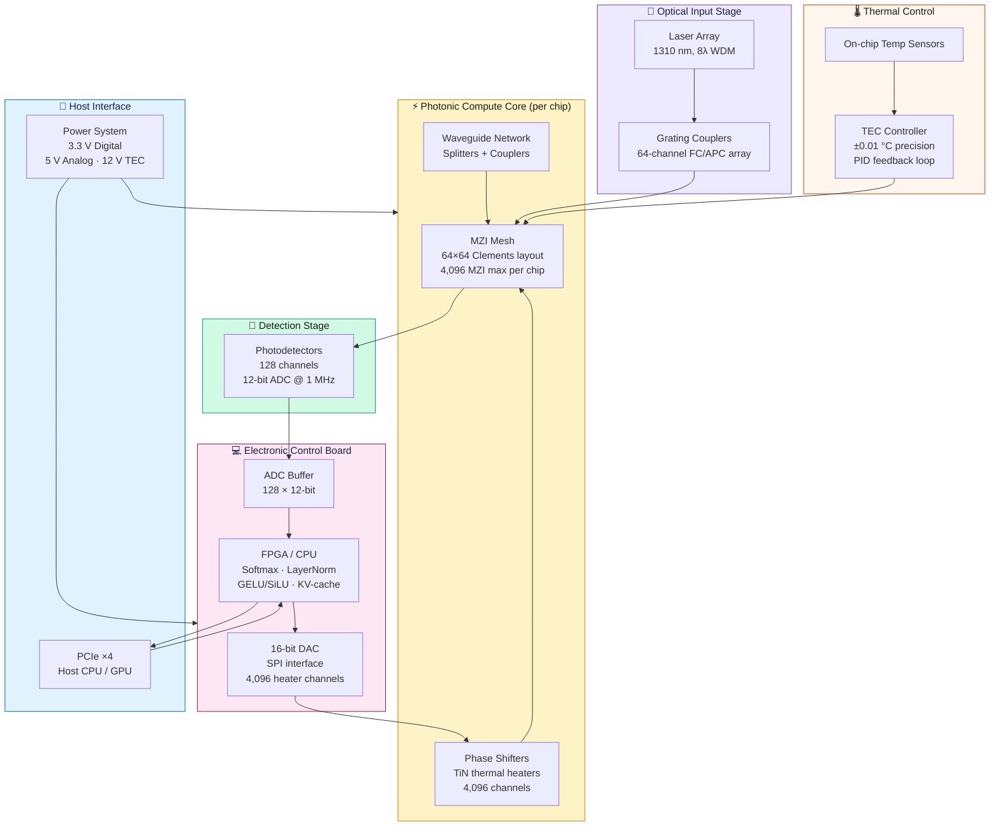

# PhotoMedGemma — System Design

**Photonic Compilation of a Medical Foundation Model**

---

## 1. Project Overview

PhotoMedGemma is a full-stack photonic AI compilation system that statically maps Google's MedGemma-4B medical foundation model onto an integrated Mach-Zehnder Interferometer (MZI) photonic chip. Rather than executing inference digitally, the system encodes trained weight matrices as optical phase angles in a silicon photonic mesh, performing matrix–vector multiplication at the speed of light with dramatically reduced energy per operation.

The design targets the **hybrid electro-optic paradigm**: all linear algebra — attention QKV projections and FFN gate/up/down operations — executes optically, while non-linear operations (softmax, LayerNorm, GELU/SiLU, KV-cache management) are handled by an on-board FPGA/CPU. This document describes the end-to-end system design, dataflow pipeline, physical block architecture, module decomposition, and key metrics derived from the repository source files.

> **Repository:** [github.com/GabuGravin41/photonmedgemma](https://github.com/GabuGravin41/photonmedgemma)

---

## 2. System-Level Key Metrics

| Parameter | Value | Source / Note |
|---|---|---|
| **Chip die size** | 10 mm × 10 mm | `docs/chip_architecture.md` |
| **MZI per chip (max)** | 4,096 | `chip_architecture.md` |
| **Clements mesh size** | 64 × 64 (unitary) | `clements.py`, `mesh.py` |
| **Optical wavelength** | 1,310 nm ± 400 GHz WDM | `chip_architecture.md` |
| **WDM lanes** | 8 λ per fiber array | `chip_architecture.md` |
| **Fiber I/O** | 64-channel FC/APC (input + output) | `chip_architecture.md` |
| **Heater channels per chip** | 4,096 (TiN thermal) | `phase_shifter.py` |
| **DAC resolution** | 16-bit via SPI | `phase_encoder.py` |
| **ADC channels** | 128 × 12-bit @ 1 MHz | `photodetector.py` |
| **System power / layer** | ~8 W (optical compute path) | `power_model.py` |
| **GPU baseline** | ~300 W/layer (H100 equivalent) | `README.md` |
| **Power reduction** | ~97% vs GPU baseline | `power_model.py` |
| **SVD energy threshold** | 99% (rank selection default) | `layer_decomposer.py` |
| **Phase quantization** | 12-bit DAC encoding | `phase_encoder.py` |
| **Heater π-shift power** | 10–20 mW per MZI (static) | `chip_architecture.md` |
| **Multi-chip per model (est.)** | 12,880 chips total | `README.md` |
| **Module size** | 100 mm × 100 mm (multi-chip) | `chip_architecture.md` |
| **Thermal precision** | ±0.01 °C via TEC + PID | `chip_architecture.md` |
| **Host interface** | PCIe ×4 | `chip_architecture.md` |
| **Phase address scheme** | PhaseMap `(layer, matrix, row, col) → (chip_id, register)` | `phase_encoder.py` |

---

## 3. End-to-End Dataflow Pipeline

The compilation pipeline transforms a HuggingFace transformer checkpoint into a set of DAC register values that program the photonic chip. The flow is entirely **static**: no runtime gradient computation is performed on-chip. The seven-stage pipeline is described below and visualised in the Mermaid flowchart.

---

### End-to-End Compilation Pipeline

---

### 3.1 Stage-by-Stage Pipeline Breakdown

| Stage | Module / File | Input | Output | Key Operation |
|---|---|---|---|---|
| 1. Model Load | `model_parser.py` | HF model `google/medgemma-4b-it` | Weight tensors (q, k, v, o, gate, up, down) | Export linear layers + vision encoder analogues |
| 2. SVD Decomposition | `layer_decomposer.py` | Full-rank weight matrices W | U, Σ, Vᵀ (rank-truncated) | SVD → energy threshold 99% → rectangular pad → power-of-2 |
| 3. Unitary Factorisation | `clements.py` + `mesh.py` | Unitary matrices U, V | MZI list (θᵢ, φᵢ) | Clements decomposition → per-layer MZI mesh layout |
| 4. Phase Encoding | `phase_encoder.py` | MZI angles (θ, φ) | PhaseMap: `(layer, row, col) → (chip_id, register)` | 12-bit quantization → DAC register mapping + calibration metadata |
| 5. Netlist Generation | `netlist_generator.py` | PhaseMap + mesh topology | `.pntl` photonic netlist | Assigns component IDs, waveguide routing, coupler specs |
| 6. GDS Layout | `generate_layout.py` | `.pntl` netlist | `.gds` chip layout | Full physical placement: MZI cells, waveguides, grating couplers, bond pads |
| 7. Simulation / Validation | `error_analysis.py`, `power_model.py` | `.gds` + PhaseMap | Error / power reports | Phase error due to quantization & fab tolerances; laser power budget |

---

#### Stage 1 — Model Parsing (`model_parser.py`)

The parser loads the MedGemma-4B model from HuggingFace (`google/medgemma-4b-it`) and extracts all linear-layer weight tensors that are candidates for optical acceleration. This includes the multi-head attention projections (Q, K, V, O) and the feed-forward network projections (gate, up, down). Vision encoder analogues are also extracted for multimodal layers. Output is a dictionary of named NumPy/PyTorch tensors indexed by layer and sub-component.

#### Stage 2 — Layer Decomposition & SVD (`layer_decomposer.py`)

Each weight matrix **W ∈ ℝ^{m×n}** is factored via Singular Value Decomposition: **W = U Σ Vᵀ**. Singular values are sorted descending and a rank threshold retains the minimum rank *r* such that cumulative energy exceeds the threshold (default 99%). The low-rank approximation preserves the essential linear transformation while reducing optical component count. Matrices are zero-padded to rectangular shapes and extended to the nearest power-of-two dimension, a requirement of the Clements mesh.

- SVD energy settings supported: 90%, 95%, 99%, 99.9%
- Padding strategy: rectangular pad then power-of-2 extension
- Output: separate U (left unitary) and Vᵀ (right unitary) for independent mesh deployment

#### Stage 3 — Clements Decomposition & MZI Mapping (`clements.py`, `mesh.py`, `mzi_mapper.py`)

Unitary matrices U and V are decomposed into sequences of 2×2 MZI operations using the Clements architecture — a proven factorisation that maps any N×N unitary to ⌊N²/2⌋ MZI cells arranged in a diagonal-column pattern. Each MZI is parameterised by an internal beamsplitter angle θ and an external phase φ. The `mzi_mapper.py` module assigns each MZI to a physical position on the chip mesh and generates a phase screen for the diagonal Σ matrix encoded via attenuators or additional phase elements.

- Clements pattern: universal for N×N unitary, depth O(N), stable numerical conditioning
- Each chip implements a 64×64 Clements mesh (4,096 MZI) as its fundamental compute tile
- Larger matrices span multiple chips, connected via inter-chip optical fibres

#### Stage 4 — Phase Encoding & PhaseMap (`phase_encoder.py`)

The MZI angles (θ, φ) produced by Clements decomposition are quantized to 12-bit integer codes and registered in the **PhaseMap** data structure. PhaseMap is the central addressing scheme: it maps a logical coordinate `(layer_id, matrix_id, row, col)` to a physical coordinate `(chip_id, register_address)`. This abstraction allows the compiler to target arbitrary multi-chip assemblies without awareness of physical chip topology during earlier stages.

- Quantization: 12-bit → 4,096 DAC levels per phase channel
- Calibration metadata stored per chip for phase drift correction
- SPI packet format: `chip_id (16-bit) | register (12-bit) | value (16-bit)`

#### Stage 5 & 6 — Netlist and GDS Generation (`netlist_generator.py`, `generate_layout.py`)

The netlist generator outputs a `.pntl` photonic netlist describing all components (MZI cells, waveguides, splitters, grating couplers, bond pads) and their interconnects. This netlist is consumed by `generate_layout.py`, which produces a standard GDSII (`.gds`) file representing the full physical chip layout at the lithographic level. The layout includes the Clements MZI mesh, input/output grating coupler arrays on north/south chip edges, and DAC/ADC/TEC bond pad rings on east/west edges.

#### Stage 7 — Error Analysis & Power Validation

Before committing to fabrication, `error_analysis.py` simulates the effect of phase quantization noise and expected fabrication tolerances (waveguide width variation, heater resistance spread) on model accuracy. `power_model.py` computes the end-to-end power budget: laser input power, per-MZI heater energy, and ADC/DAC board power, yielding the ~8 W/layer projection versus ~300 W for equivalent GPU inference.

---

## 4. Physical System Architecture

The PhotoMedGemma hardware system is organised into five functional subsystems: optical input, photonic compute core, detection, electronic control, and host interface. A TEC-based thermal subsystem maintains isothermal chip operation, critical for phase stability.

---

### Physical System Block Diagram

---

### 4.1 Optical Input Stage

- Laser array operating at 1,310 nm centre wavelength
- 8 WDM channels spaced at ±400 GHz intervals for spectral multiplexing
- 64-channel FC/APC fiber array couples light onto chip via edge grating couplers
- Grating couplers located on north/south die edges; target coupling efficiency >80%

### 4.2 Photonic Compute Core

The photonic core is a programmable MZI mesh implementing a 64×64 Clements unitary on a single 10 mm × 10 mm die. The mesh is the optical analogue of a weight matrix: by setting phase shifter voltages, any target unitary transformation (corresponding to a trained weight matrix after SVD) can be programmed.

- 4,096 MZI cells per chip, each with θ and φ degrees of freedom
- TiN thermal phase shifters: π-phase shift at 10–20 mW static power
- Waveguides, 50/50 splitters, and 2×2 directional couplers form the mesh fabric
- Multiple chips tile larger matrices; a single attention head uses ~40 chips
- Inter-chip connections via fibre ribbon; 100 mm × 100 mm multi-chip module

### 4.3 Photodetection & ADC

- 128 integrated photodetectors capture optical output intensities
- 12-bit ADC sampling at 1 MHz per channel provides amplitude resolution
- Detector array maps to the 64-channel output of each Clements mesh column

### 4.4 Electronic Control Board

The electronic board bridges the digital host and the analogue photonic core. It hosts the DAC array, ADC buffers, and the FPGA/CPU that handles all non-linear computations which cannot be performed optically.

- 16-bit DAC array: 4,096 channels, SPI control, drives TiN phase heaters
- FPGA/CPU functions: softmax, layer normalisation, GELU/SiLU activation, KV-cache
- ADC buffer: 128 × 12-bit channels feed digital non-linear pipeline
- PCIe ×4 host interface for programming, data transfer, and calibration

### 4.5 Power & Thermal Systems

- **3.3 V digital rail:** FPGA, SPI logic, microcontroller
- **5 V analogue rail:** DAC, ADC, laser driver
- **12 V TEC rail:** Thermo-Electric Cooler for chip temperature stabilisation
- PID feedback loop: on-chip temperature sensors → TEC set-point → ±0.01 °C stability

---

## 5. Module & Layer Decomposition

### 5.1 Photonic Primitive Modules (`src/photonic/`)

| Module | File | Function |
|---|---|---|
| **MZI Cell** | `mzi.py` | 2×2 unitary with θ/φ; balanced and unbalanced modes; electro-optic transfer matrix |
| **MZI Mesh** | `mesh.py` | Stage-by-stage MZI interconnect; Clements and Reck decomposition patterns |
| **Phase Shifter** | `phase_shifter.py` | TiN thermal model; resistance, tuning range, π-shift power (10–20 mW) |
| **Waveguide** | `waveguide.py` | Single-mode waveguide propagation; loss model; bend radius constraints |
| **Splitter** | `splitter.py` | 1×2 / 2×2 Y-junction and directional coupler models |
| **Grating Coupler** | `grating_coupler.py` | Fibre-to-chip coupling; period, duty cycle, insertion loss; 1310 nm optimised |
| **Photodetector** | `photodetector.py` | Responsivity model; noise floor; 128-channel array geometry |

### 5.2 Architecture Layers (`src/photonic/architecture/`)

- **`attention.py`** — Multi-head attention optical forward pass
- **`feedforward.py`** — FFN gate/up/down optical pipeline with SiLU on FPGA
- **`layer_norm.py`** — Digital LayerNorm (FPGA); feeds normalised activation back to optical input
- **`medgemma_photonic.py`** — Model-level orchestration; routes activations through all 26 transformer blocks; manages chip addressing

### 5.3 Compiler Modules (`src/compiler/`)

- **`model_parser.py`** — HuggingFace checkpoint → weight tensor dictionary
- **`layer_decomposer.py`** — SVD + rank truncation + rectangular pad + power-of-2
- **`clements.py`** — Universal Clements decomposition algorithm for N×N unitary
- **`mzi_mapper.py`** — Assigns Clements output to physical mesh positions per chip
- **`phase_encoder.py`** — Quantisation + PhaseMap construction + calibration metadata
- **`netlist_generator.py`** — `.pntl` photonic netlist with component IDs and routing
- **`generate_layout.py`** — GDSII layout generation; full-chip physical design
- **`compile_model.py`** — Top-level orchestration script; runs all stages end-to-end

---

## 6. Multi-Chip Deployment Architecture

MedGemma-4B contains 26 transformer layers, each requiring multiple matrix multiplications. Because each attention head projects through matrices of dimension 2,048 — which exceeds the 64×64 mesh native size — matrices are tiled across multiple chips.

| Component | Matrix Dimensions | Chips per Head | Notes |
|---|---|---|---|
| Q / K / V Proj. | 2,048 × 2,048 | ~32 chips each | 4 heads × 3 projections = 384 chips/layer |
| O Proj. | 2,048 × 2,048 | ~32 chips | Output projection per layer |
| FFN Gate / Up | 2,048 × 8,192 | ~128 chips each | Expanded FFN width |
| FFN Down | 8,192 × 2,048 | ~128 chips | Contraction back to model dim |
| Vision Encoder | Variable | ~160 chips | Vision token projection analogues |

Total estimated chip count across the full MedGemma-4B model: **~12,880 chips** arranged in a 100 mm × 100 mm multi-chip module per layer group. The PhaseMap addressing scheme allows the host controller to address any chip and register within the array via standard PCIe ×4 DMA transfers.

---

## 7. Repository Implementation Reference

| Design Concept | Repository File(s) | Implementation Detail |
|---|---|---|
| Weight extraction | `src/compiler/model_parser.py` | Loads HF checkpoint; exports Q/K/V/O + FFN tensors + vision encoder |
| SVD + rank truncation | `src/compiler/layer_decomposer.py` | `torch.linalg.svd`; energy threshold filter; rectangular pad; pow-2 extension |
| Clements decomposition | `src/compiler/clements.py` | Column-by-column Givens rotation elimination; returns (θ, φ) per MZI |
| Mesh layout | `src/compiler/mesh.py` + `mzi_mapper.py` | Stage-by-stage MZI grid; physical (row, col) assignment per chip |
| Phase encoding | `src/compiler/phase_encoder.py` | Float angle → 12-bit int; PhaseMap dict; SPI register map; calibration metadata |
| Netlist | `src/compiler/netlist_generator.py` | `.pntl` XML/JSON; component IDs; waveguide routing table |
| GDS layout | `src/compiler/generate_layout.py` | gdspy/klayout calls; MZI cells; coupler placement; bond pad ring |
| Full compile run | `src/compiler/compile_model.py` | Top-level orchestrator; reads `medgemma_4b_config.yaml` + `chip_platform_config.yaml` |
| MZI physics | `src/photonic/mzi.py` | Transfer matrix `[[cos θ, i·sin θ], [i·sin θ, cos θ]] · diag(e^{iφ}, 1)` |
| Mesh simulation | `src/photonic/mesh.py` | Chain of MZI transfer matrices; propagate field vector |
| Phase shifter model | `src/photonic/phase_shifter.py` | TiN heater: ΔΦ = α·ΔT; R, V, I, P model; tuning range 0–2π |
| Photodetection | `src/photonic/photodetector.py` | Responsivity curve; shot noise; thermal noise; 128-channel array |
| Attention layer | `src/photonic/attention.py` | Optical QKV; softmax on FPGA; optical O projection; residual add |
| FFN layer | `src/photonic/feedforward.py` | Optical gate/up; FPGA SiLU; optical down; residual |
| Model orchestration | `src/photonic/medgemma_photonic.py` | 26-layer loop; chip routing; token flow; KV-cache management |
| Error analysis | `src/compiler/error_analysis.py` | Phase noise → output SNR; fab tolerance Monte-Carlo |
| Power model | `src/compiler/power_model.py` | Laser P_in; N_heater × P_heater; ADC/DAC quiescent; total per layer |
| Chip architecture spec | `docs/chip_architecture.md` | Die size, MZI count, fiber I/O, DAC/ADC specs, PCIe, power rails, TEC |
| Pipeline documentation | `docs/compilation_pipeline.md` | Stage descriptions, data formats, config YAML references |
| Config: model | `medgemma_4b_config.yaml` | Layer count, hidden dim, head count, rank settings per layer type |
| Config: process | `chip_platform_config.yaml` | Waveguide loss, coupler ER, heater coefficients, fab tolerances |
| Tests | `tests/` + `test_clements.py` | Unit tests for Clements correctness, mesh unitarity, phase quantisation error |

---

## 8. Design Innovation & Photonic Advantage

> **Static Compilation**
> All weight information is encoded once at compile time into phase angles. No on-chip training or backpropagation is required, enabling ultra-low-power deployment.

> **SVD-Based Photonic Compression**
> Low-rank approximation via SVD reduces the number of MZI elements needed per layer, directly lowering chip count, power, and latency.

> **Universal Clements Mesh**
> The Clements architecture is proven optimal for implementing arbitrary unitary transformations with minimum optical depth, enabling the shallowest possible waveguide mesh.

> **PhaseMap Abstraction**
> A layer-agnostic addressing scheme decouples the logical model graph from the physical chip topology, enabling seamless multi-chip scaling.

> **Hybrid Electro-Optic Architecture**
> Only linear operations run optically; non-linearities (softmax, GELU, LayerNorm) are delegated to a digital FPGA, maximising optical utilisation efficiency.

> **Medical AI Specialisation**
> MedGemma-4B's multimodal vision-language capability for clinical imaging and text is preserved through the photonic mapping of both vision encoder and language model layers.

---

*Repository: [github.com/GabuGravin41/photonmedgemma](https://github.com/GabuGravin41/photonmedgemma)*